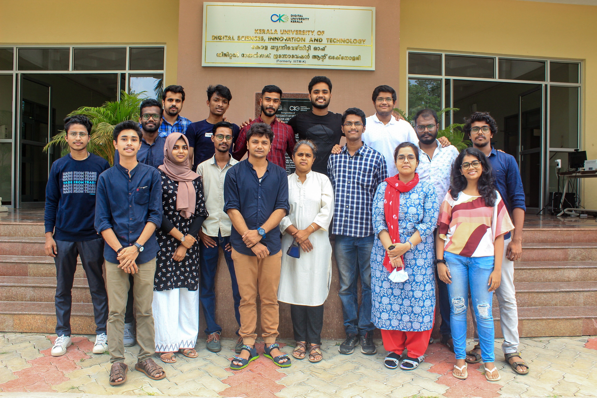

## Research Interests
* [Computer Vision](https://en.wikipedia.org/wiki/Computer_vision)
* [Image](https://en.wikipedia.org/wiki/Digital_image_processing) / [Video Signal Processing](https://en.wikipedia.org/wiki/Video_processing)

## Openings
* [Mar 2023] [PhD Openings](https://duk.ac.in/admissions2023/): 
    Currently seeking brilliant and highly motivated PhD students to join our research group. 

* [Jun 2023] Paid Internship: 
    Currently seeking brilliant and highly motivated BTech /MSc students to join for internship for two months. 
    
    
    
## Contact Details
&nbsp;&nbsp;&nbsp;&nbsp;&nbsp;&nbsp;Image and Vision Computing Lab 
&nbsp;&nbsp;&nbsp;&nbsp;&nbsp;&nbsp;Digital University Kerala (formerly IIITM-Kerala) 
&nbsp;&nbsp;&nbsp;&nbsp;&nbsp;&nbsp;Technocity, Mangalapuram 
&nbsp;&nbsp;&nbsp;&nbsp;&nbsp;&nbsp;PO Thonnakkal,Thiruvananthapuram  
&nbsp;&nbsp;&nbsp;&nbsp;&nbsp;&nbsp;Kerala 695 317 India   
&nbsp;&nbsp;&nbsp;&nbsp;&nbsp;&nbsp;+91-471-2788088  
  

 

  

<small>Successful and unsuccessful people do not vary greatly in their abilities.They vary in their desires to reach their potential. – John Maxwell </small>

